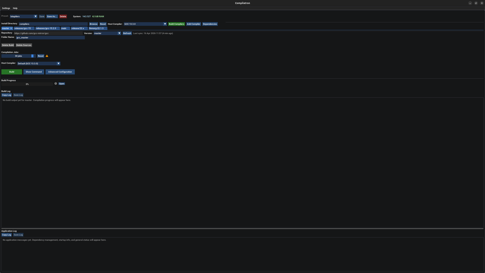
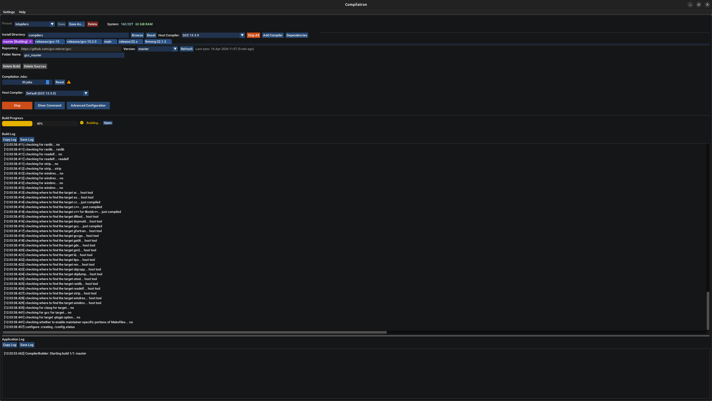
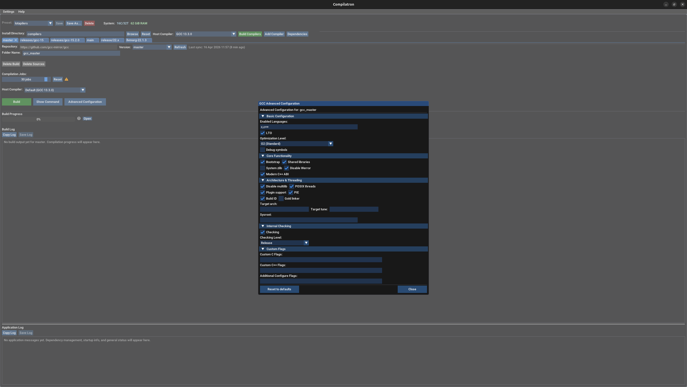
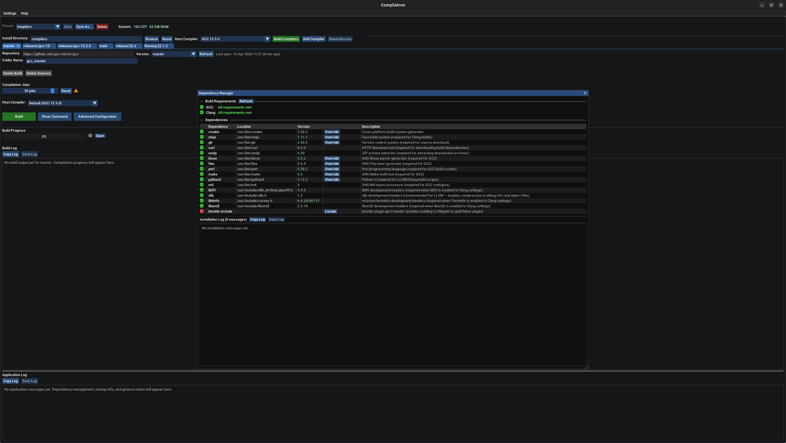

# Compilatron

A GUI application for building GCC and Clang compilers from source. Compilatron handles the entire process — dependency detection and installation, source downloading, configuration, compilation, and installation — through a native C++ interface built on ImGui.

## Screenshots

| Main window | Active build |
|:-----------:|:------------:|
|  |  |

| Advanced settings | Dependency manager |
|:-----------------:|:-----------------:|
|  |  |

## What it does

- Builds GCC and Clang compilers from source with full control over versions, targets, and options
- Manages build dependencies (autoconf, automake, libtool, ninja, cmake, etc.) with per-dependency version tracking
- Browses available compiler versions from GitHub with branch/tag filtering
- Tracks build progress per compiler with live log output
- Persists settings and previously built compiler locations across sessions

## Requirements

- Linux (x86_64 or ARM64)
- C++23-capable compiler (GCC 13+ or Clang 15+)
- CMake 4.3.0+
- OpenGL and X11 development headers (GLFW is vendored and built automatically)
- 10+ GiB free disk space for compiler sources and build artifacts
- 16+ GiB RAM recommended when building GCC/Clang with Compilatron (not required to build Compilatron itself)

## Building Compilatron itself

### Quick setup

```bash
git clone --recurse-submodules https://github.com/your-username/compilatron compilatron
cd compilatron
./setup.sh        # detects distro, installs deps, builds
```

`setup.sh` accepts several options:

```bash
./setup.sh --compiler /path/to/g++         # use a specific compiler binary or install root
./setup.sh --cmake /path/to/cmake          # use a specific cmake binary or install root
./setup.sh --static                        # statically link libstdc++ (recommended with custom compilers)
./setup.sh --no-deps                       # skip system package installation
./setup.sh --no-build                      # skip the build step
```

If built with a compiler newer than the system GCC (e.g. a custom GCC 15), use `--static` to avoid a `GLIBCXX` version mismatch when running on the same or other machines.

### Manual

Install system dependencies first:

**Ubuntu / Debian**
```bash
sudo apt install -y ninja-build pkg-config \
    libgl1-mesa-dev \
    libx11-dev libxrandr-dev libxinerama-dev libxcursor-dev libxi-dev
```

**Fedora / RHEL family**
```bash
sudo dnf install -y ninja-build \
    mesa-libGL-devel \
    libX11-devel libXrandr-devel libXinerama-devel libXcursor-devel libXi-devel
```

**openSUSE**
```bash
sudo zypper install -y ninja pkg-config \
    Mesa-libGL-devel \
    libX11-devel libXrandr-devel libXinerama-devel libXcursor-devel libXi-devel
```

**Arch Linux**
```bash
sudo pacman -S --needed ninja \
    mesa libx11 libxrandr libxinerama libxcursor libxi
```

Or let the Makefile do it:
```bash
make install-deps     # auto-detects distro
```

Then build:
```bash
make          # release build, all cores
```

Run it directly from the build output:
```bash
./build/cmake-Release/Compilatron
```

To install (optional — registers desktop entry and icon):
```bash
make install CMAKE_INSTALL_PREFIX=~/.local   # current user only (recommended)
sudo make install                            # system-wide (/usr/local)
```

To uninstall, right-click the Compilatron icon in your app launcher and choose **Uninstall Compilatron**, or run the uninstall script directly:
```bash
compilatron-uninstall            # if installed to ~/.local
sudo compilatron-uninstall       # if installed system-wide
```

Other build options:
```bash
make CONFIG=Debug                # debug build
make STATIC=yes                  # statically link C++ runtime
make COMPILER=/path/to/clang++   # use a specific compiler
make JOBS=8                      # override parallel job count
```

## CMake presets

The project ships with presets for common configurations:

```bash
cmake --preset ctrn-linux-clang-release
cmake --build --preset ctrn-linux-clang-release -j$(nproc)
```

To use a custom compiler, set `CTRN_CLANG_PATH` or `CTRN_GCC_PATH` in your environment or in a `CMakeUserPresets.json` (gitignored). Available preset suffixes: `-debug`, `-release`.

## Repository structure

```
compilatron/
├── code/                   # All source code
│   ├── build/              # Compiler build engine (CCompilerUnit, CClangUnit, CGccUnit, CCompilerBuilder)
│   ├── common/             # Shared utilities (process executor, CPU info, loggers, common globals)
│   ├── dependency/         # Dependency management system
│   └── gui/                # ImGui interface (CCompilerGUI, version manager, preset manager)
├── cmake/
│   ├── compilers/          # Warning flags per compiler (clang.cmake, gcc.cmake)
│   ├── toolchains/linux/   # Compiler selection via env vars
│   └── uninstall.cmake     # Uninstall script (reads install_manifest.txt)
├── external/
│   ├── imgui/              # ImGui v1.92.6 (vendored)
│   ├── glfw/               # GLFW submodule (built from source)
│   └── tge-core/           # tge-core submodule (logging, base utilities)
├── resources/              # Application icons
├── CMakeLists.txt
├── CMakePresets.json
├── Makefile                # Thin CMake wrapper
└── setup.sh                # One-shot setup script
```

## Dependencies

Compilatron uses three external libraries, all vendored — no system library packages required beyond OpenGL and X11:

- **ImGui v1.92.6** — vendored under `external/imgui/`, built as part of the project
- **GLFW** — git submodule under `external/glfw/`, built as part of the project
- **tge-core** — git submodule under `external/tge-core/`, provides logging (`CLog`) and base utilities (`SNoCopyNoMove`, `CMpscQueue`)

After cloning, initialise submodules if not using `--recurse-submodules`:

```bash
git submodule update --init --recursive
```

## Build options reference

| Option | Default | Description |
|--------|---------|-------------|
| `CONFIG` | `Release` | Build type: `Debug`, `Release`, `RelWithDebInfo`, `MinSizeRel` |
| `COMPILER` | auto-detected | Path to C++ compiler |
| `STATIC` | `no` | `yes` to statically link C++ runtime |
| `JOBS` | all cores | Parallel job count |

## Troubleshooting

**"No C++ compiler found"** — install `build-essential` (Debian/Ubuntu) or `gcc-c++` (Fedora/openSUSE) and verify with `make test-compiler`.

**`GLIBCXX` version not found when running the binary** — the binary was built with a newer compiler than the system libstdc++. Rebuild with `./setup.sh --static` or `make STATIC=yes` to produce a self-contained binary.

**glibc version mismatch when running on another machine** — build on the target system, or use `./setup.sh --static` / `make STATIC=yes`.

**Out of memory during a compiler build** — reduce the job count in the Compilatron settings panel. Allow roughly 4 GiB RAM per parallel link job for release builds, 9 GiB for debug builds.

## License

MIT — see [LICENSE](LICENSE).
